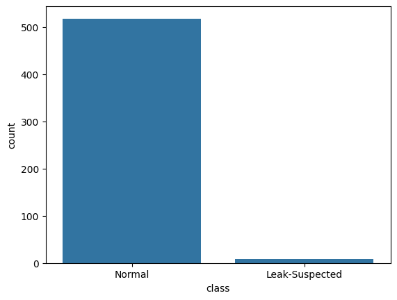
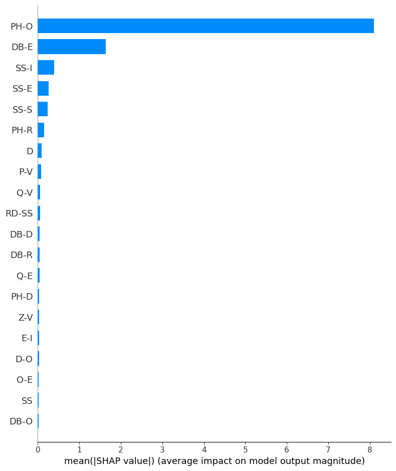

# Leak Prediction

## Overview
Smart Water Distribution Optimization is an award-winning solution designed to detect and predict leaks in water treatment systems using advanced machine learning techniques. This project leverages real-world data and state-of-the-art models to help utilities minimize water loss and improve operational efficiency.

## Features
- Leak detection and prediction using LightGBM, SVC and XGBoost classifiers
- Data preprocessing and handling of missing values based on distribution analysis
- Imbalanced class handling with SMOTE oversampling
- Feature importance analysis using SHAP
- Model performance evaluation with classification reports and confusion matrices


*Figure 1 Imbalanced Class*


*Figure 2 Important Features*

## Dataset
The project uses the [UCI Water Treatment Plant Dataset](https://archive.ics.uci.edu/ml/datasets/Water+Treatment+Plant), which contains time-series measurements from a real water treatment facility. The dataset is included in the `leak_prediction/data/` folder:
- `water-treatment.data`: Main data file
- `water-treatment.names`: Feature descriptions
- `cleaned_water_treatment.csv`: Preprocessed data

## How It Works
1. **Data Loading & Cleaning**: Loads the dataset, analyzes missing values, and fills them using mean or median based on feature distribution.
2. **Exploratory Analysis**: Visualizes distributions and checks for class imbalance.
3. **Preprocessing**: Encodes target classes and applies SMOTE to balance the dataset.
4. **Model Training**: Trains LightGBM, SVC and XGBoost classifiers to predict leak events.
5. **Evaluation**: Outputs classification reports and confusion matrices for model assessment.
6. **Feature Importance**: Uses SHAP to interpret model decisions and highlight key features.
7. **Model Export**: Saves the trained model as `leak_detection_model.pkl` for future use.

## Getting Started
### Prerequisites
- Python 3.10+
- pipenv (recommended) or pip

### Installation
1. Clone the repository:
	```bash
	git clone https://github.com/hendrixian/Smart-Water-Distribution-Optimization.git
	cd Smart-Water-Distribution-Optimization
	```
2. Install dependencies:
	```bash
	pipenv install
	```

## Folder Structure
- `leak_prediction/`
  - `leak_pred.ipynb`: Main notebook
  - `leak_detection_model.pkl`: Saved model
  - `data/`: Dataset files

## Results
The project achieves high accuracy in leak detection, with detailed classification reports and confusion matrices included in the notebook. Feature importance analysis reveals key indicators for leak events, supporting actionable insights for water utilities.

### Model Performance Comparison

| Model                | SMOTE | Leak-Suspected Precision | Leak-Suspected Recall | Normal Precision | Normal Recall | Accuracy | Confusion Matrix |
|----------------------|-------|-------------------------|----------------------|------------------|--------------|----------|-----------------|
| LightGBM             | No    | 1.00                    | 0.50                 | 0.99             | 1.00         | 0.99     | [[1, 1], [0, 104]] |
| XGBoost              | No    | 0.00                    | 0.00                 | 0.98             | 1.00         | 0.98     | [[104, 0], [2, 0]] |
| SVC              | No    | 1.00                    | 0.03                 | 0.02             | 1.00         | 0.05     | [[3, 101], [0, 2]] |
| LightGBM             | Yes   | 1.00                    | 1.00                 | 1.00             | 1.00         | 1.00     | [[104, 0], [0, 104]] |
| XGBoost              | Yes   | 1.00                    | 0.99                 | 0.99             | 1.00         | 1.00     | [[104, 0], [1, 103]] |
| SVC              | Yes   | 0.52                    | 1.0                 | 1.00             | 0.09         | 0.54     | [[104, 0], [95,9]] |

**Notes:**
- SMOTE (Synthetic Minority Over-sampling Technique) balances the dataset, significantly improving recall for the minority class (Leak-Suspected).
- Without SMOTE, models struggle to detect leak events due to class imbalance.
- With SMOTE, both LightGBM and XGBoost achieve perfect or near-perfect classification for both classes but SVC struggle to classify.

Feature importance analysis reveals key indicators for leak events, supporting actionable insights for water utilities.